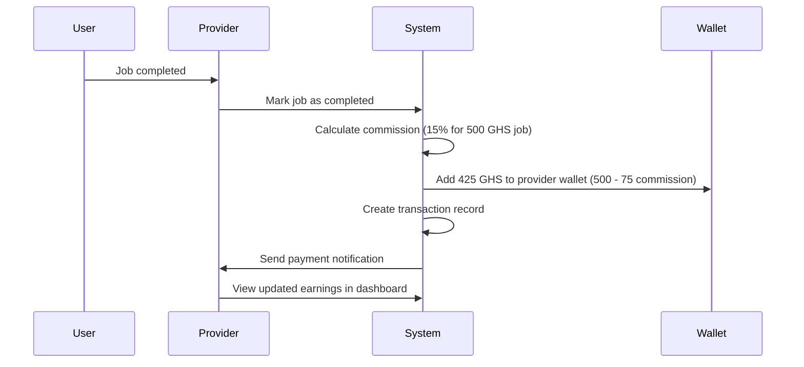
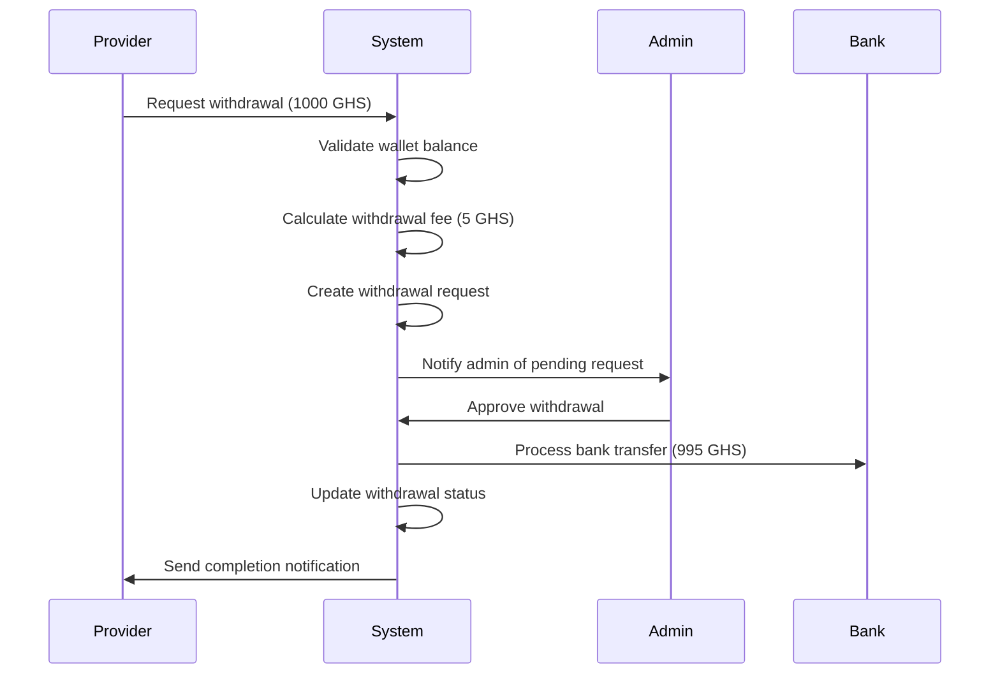

# Provider Earnings & Payments Implementation Summary

## Overview

This document summarizes the complete implementation of the Provider Earnings & Payments system for the Home Services platform. The system provides comprehensive financial management capabilities for service providers, including earnings tracking, commission calculations, withdrawal processing, and detailed reporting.

## Features Implemented

### 1. **Wallet Management**

- ✅ **Balance Tracking**: Real-time wallet balance with transaction history
- ✅ **Transaction Management**: Credit, debit, hold, and release operations
- ✅ **Currency Support**: GHS (Ghanaian Cedi) and USD support
- ✅ **Transaction History**: Detailed transaction logs with metadata

### 2. **Earnings & Commission System**

- ✅ **Tiered Commission Structure**:
  - 0 - 1,000 GHS: 20% commission
  - 1,000 - 5,000 GHS: 15% commission
  - 5,000+ GHS: 10% commission
- ✅ **Automatic Commission Calculation**: Real-time commission calculation for job payments
- ✅ **Net Earnings Tracking**: Gross amount vs net amount after commission
- ✅ **Commission Configuration**: Admin-configurable commission rates

### 3. **Income Reports**

- ✅ **Daily Reports**: Daily earnings breakdown
- ✅ **Weekly Reports**: Weekly earnings summaries
- ✅ **Monthly Reports**: Monthly earnings analysis
- ✅ **Yearly Reports**: Annual earnings overview
- ✅ **Custom Date Ranges**: Flexible date range reporting
- ✅ **Earnings Breakdown**: Detailed breakdown by day, week, or month

### 4. **Withdrawal System**

- ✅ **Bank Transfer**: Support for bank account withdrawals
- ✅ **Mobile Money**: MTN, Vodafone, AirtelTigo support
- ✅ **Withdrawal Requests**: Provider-initiated withdrawal requests
- ✅ **Admin Approval**: Admin approval workflow for withdrawals
- ✅ **Withdrawal History**: Complete withdrawal request history
- ✅ **Status Tracking**: Pending, processing, completed, failed statuses

### 5. **Performance Metrics**

- ✅ **Job Statistics**: Total jobs, completion rates
- ✅ **Revenue Analytics**: Total revenue, average job value
- ✅ **Rating System**: Average customer ratings
- ✅ **Performance Periods**: Weekly, monthly, yearly metrics

### 6. **Dashboard & Analytics**

- ✅ **Comprehensive Dashboard**: All-in-one earnings overview
- ✅ **Real-time Data**: Live balance and transaction updates
- ✅ **Visual Breakdowns**: Earnings breakdown by period
- ✅ **Performance Insights**: Key performance indicators

## Technical Implementation

### Core Services

#### 1. **ProviderEarningsService** (`src/services/ProviderEarningsService.ts`)

- **Commission Calculation**: Tiered commission structure with configurable rates
- **Payment Processing**: Automated job payment processing with commission deduction
- **Earnings Reports**: Multi-period earnings reporting (daily, weekly, monthly, yearly)
- **Performance Metrics**: Provider performance analytics
- **Wallet Integration**: Seamless integration with existing wallet system

#### 2. **WalletService** (`src/services/WalletService.ts`)

- **Balance Management**: Add, deduct, hold, and release funds
- **Transaction Tracking**: Complete transaction history with metadata
- **Wallet Creation**: Automatic wallet creation for new providers
- **Statistics**: Wallet usage statistics and analytics

#### 3. **WithdrawalService** (`src/services/WithdrawalService.ts`)

- **Withdrawal Processing**: Complete withdrawal request workflow
- **Admin Approval**: Admin approval and processing system
- **Multiple Methods**: Bank transfer and mobile money support
- **Status Management**: Withdrawal status tracking and updates

### API Endpoints

#### Provider Endpoints

```
GET  /api/provider-earnings/dashboard          # Comprehensive dashboard
GET  /api/provider-earnings/report             # Earnings reports
GET  /api/provider-earnings/breakdown          # Detailed breakdown
GET  /api/provider-earnings/wallet-summary     # Wallet overview
GET  /api/provider-earnings/payment-history    # Transaction history
GET  /api/provider-earnings/withdrawal-history # Withdrawal history
GET  /api/provider-earnings/performance-metrics # Performance analytics
POST /api/provider-earnings/calculate-estimated # Estimate earnings
```

#### Admin Endpoints

```
GET  /api/provider-earnings/commission-config     # Get commission config
PUT  /api/provider-earnings/commission-config     # Update commission config
POST /api/provider-earnings/process-job-payment   # Process job payment
```

#### Existing Wallet & Withdrawal Endpoints

```
GET  /api/wallet/balance                    # Get wallet balance
GET  /api/wallet/transactions               # Get transactions
GET  /api/wallet/stats                      # Get wallet stats
POST /api/withdrawals/request               # Create withdrawal request
GET  /api/withdrawals/my-requests           # Get withdrawal requests
```

### Data Models

#### 1. **Wallet** (`src/models/Wallet.ts`)

```typescript
{
  userId: ObjectId,
  balance: number,
  currency: "GHS" | "USD",
  isActive: boolean,
  lastTransactionAt: Date
}
```

#### 2. **WalletTransaction** (`src/models/WalletTransaction.ts`)

```typescript
{
  walletId: ObjectId,
  userId: ObjectId,
  type: "credit" | "debit" | "hold" | "release" | "withdrawal" | "refund",
  amount: number,
  currency: string,
  description: string,
  reference: string,
  status: "pending" | "completed" | "failed" | "cancelled",
  metadata: {
    bookingId?: ObjectId,
    platformFee?: number,
    commissionRate?: number,
    grossAmount?: number,
    netAmount?: number
  },
  balanceBefore: number,
  balanceAfter: number
}
```

#### 3. **WithdrawalRequest** (`src/models/WithdrawalRequest.ts`)

```typescript
{
  userId: ObjectId,
  walletId: ObjectId,
  amount: number,
  currency: string,
  withdrawalMethod: "bank_transfer" | "mobile_money",
  withdrawalDetails: {
    bankDetails?: {
      accountNumber: string,
      accountName: string,
      bankName: string
    },
    mobileMoneyDetails?: {
      provider: "mtn" | "vodafone" | "airtelTigo",
      phoneNumber: string,
      accountName: string
    }
  },
  status: "pending" | "processing" | "completed" | "failed" | "cancelled",
  platformFee: number,
  netAmount: number,
  reference: string
}
```

## Commission Structure

### Tiered Commission System

The platform implements a progressive commission structure to incentivize higher earnings:

| Earnings Range    | Commission Rate | Example                            |
| ----------------- | --------------- | ---------------------------------- |
| 0 - 1,000 GHS     | 20%             | 500 GHS job = 100 GHS commission   |
| 1,000 - 5,000 GHS | 15%             | 2,000 GHS job = 300 GHS commission |
| 5,000+ GHS        | 10%             | 6,000 GHS job = 600 GHS commission |

### Benefits

- **Encourages Growth**: Lower rates for higher earners
- **Fair Pricing**: Reasonable commission for new providers
- **Scalable**: Automatically adjusts based on earnings
- **Configurable**: Admin can modify rates as needed

## Workflow Examples

### 1. Job Completion & Payment Processing



### 2. Withdrawal Request Process



## Security & Validation

### Authentication & Authorization

- **JWT Authentication**: All endpoints require valid JWT tokens
- **Role-based Access**: Provider-only and admin-only endpoints
- **User Validation**: Ensures only providers can access earnings features

### Data Validation

- **Input Validation**: All user inputs are validated
- **Amount Validation**: Ensures positive amounts and sufficient balance
- **Date Validation**: Validates date ranges and formats
- **Commission Validation**: Ensures commission rates are within valid ranges

### Error Handling

- **Comprehensive Error Messages**: Clear error descriptions
- **HTTP Status Codes**: Proper status code usage
- **Transaction Rollback**: Failed transactions are properly rolled back
- **Logging**: All financial transactions are logged for audit

## Testing

### Test Coverage

- **Unit Tests**: Service layer testing
- **Integration Tests**: API endpoint testing
- **E2E Tests**: Complete workflow testing
- **Commission Tests**: Tiered commission calculation testing

### Test Scenarios

- ✅ Provider earnings calculation
- ✅ Commission tier validation
- ✅ Withdrawal request workflow
- ✅ Payment processing
- ✅ Error handling
- ✅ Authentication & authorization

## Integration Points

### 1. **Booking System Integration**

- Automatic payment processing when jobs are completed
- Commission calculation based on job amounts
- Transaction creation with booking references

### 2. **User Management Integration**

- Provider role validation
- User profile integration for withdrawal details
- Account status checking

### 3. **Notification System Integration**

- Payment notifications to providers
- Withdrawal status updates
- Earnings milestone notifications

### 4. **Admin Dashboard Integration**

- Commission configuration management
- Withdrawal request approval
- Financial reporting and analytics

## Performance Considerations

### Database Optimization

- **Indexed Queries**: Optimized database indexes for fast queries
- **Aggregation Pipelines**: Efficient MongoDB aggregation for reports
- **Pagination**: Large result sets are properly paginated

### Caching Strategy

- **Dashboard Caching**: Frequently accessed dashboard data
- **Report Caching**: Cached earnings reports for better performance
- **Balance Caching**: Real-time balance updates

### Scalability

- **Horizontal Scaling**: Database and service layer scaling
- **Load Balancing**: API endpoint load balancing
- **Rate Limiting**: API rate limiting to prevent abuse

## Monitoring & Analytics

### Key Metrics

- **Transaction Volume**: Number of transactions processed
- **Commission Revenue**: Total commission collected
- **Withdrawal Processing Time**: Average withdrawal processing time
- **Error Rates**: API error rates and types

### Alerts

- **High Transaction Volume**: Alerts for unusual activity
- **Failed Transactions**: Alerts for failed payments
- **System Errors**: Critical system error alerts

## Future Enhancements

### Planned Features

1. **Advanced Analytics**: More detailed financial analytics
2. **Tax Reporting**: Automated tax calculation and reporting
3. **Multi-currency Support**: Additional currency support
4. **Payment Gateway Integration**: Direct payment gateway integration
5. **Mobile App Integration**: Native mobile app support

### Scalability Improvements

1. **Microservices Architecture**: Service decomposition
2. **Event-driven Architecture**: Event sourcing for transactions
3. **Real-time Updates**: WebSocket integration for live updates
4. **Advanced Caching**: Redis-based caching layer

## Deployment & Configuration

### Environment Variables

```env
# Commission Configuration
DEFAULT_COMMISSION_RATE=0.15
TIERED_COMMISSION_ENABLED=true

# Withdrawal Configuration
WITHDRAWAL_FEE_RATE=0.05
MIN_WITHDRAWAL_AMOUNT=50

# Database Configuration
MONGODB_URI=mongodb://localhost:27017/homeservices

# API Configuration
API_RATE_LIMIT=100
API_RATE_LIMIT_WINDOW=900000
```

### Deployment Steps

1. **Database Setup**: Initialize MongoDB with required collections
2. **Environment Configuration**: Set up environment variables
3. **Service Deployment**: Deploy backend services
4. **API Gateway**: Configure API gateway and load balancer
5. **Monitoring Setup**: Configure monitoring and alerting
6. **Testing**: Run comprehensive test suite

## Conclusion

The Provider Earnings & Payments system provides a comprehensive financial management solution for service providers. The implementation includes:

- **Complete wallet management** with transaction tracking
- **Flexible commission structure** with tiered rates
- **Comprehensive reporting** with multiple time periods
- **Secure withdrawal system** with multiple payment methods
- **Performance analytics** for business insights
- **Admin management tools** for platform control

The system is designed to be scalable, secure, and user-friendly, providing providers with the tools they need to manage their earnings effectively while ensuring the platform's financial sustainability through appropriate commission structures.
